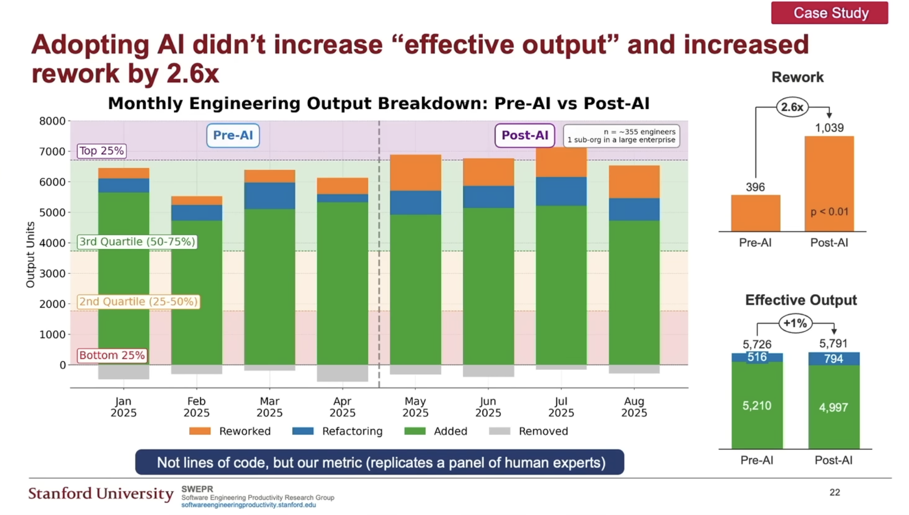
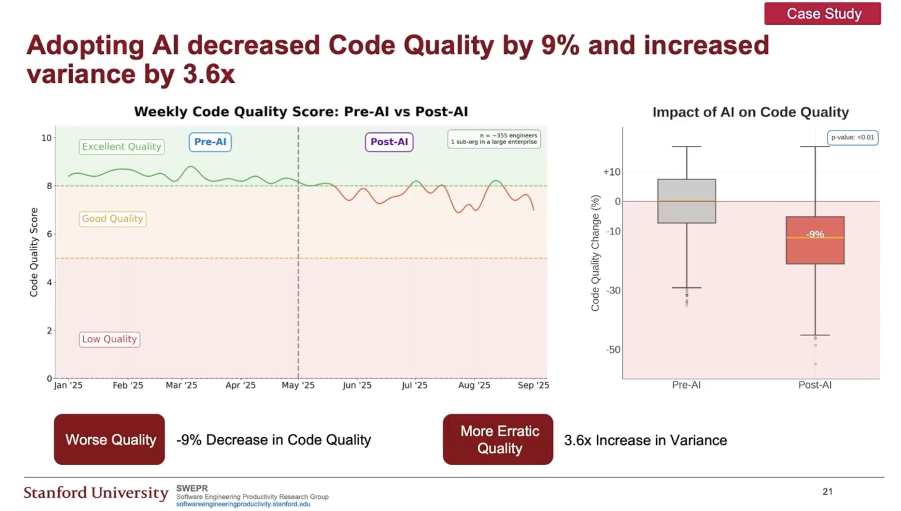

  
Code Is Not Cheap

  
Slop in the AI Era

  
Ashish Kumar Verma · imdigitalashish

---

# Quick Intro

Engineer · Researcher · Speaker

- Hosted National Program with Prime Minister
- Cracked IIT Delhi, enrolled in Engineering Physics
- Dropped out of IIT Delhi
- Published in Springer Nature's most reputed journal — youngest researcher officially (**at 20**)
- Guinness World Record — World's Largest AI Hackathon (Mentor & Judge)
- Youngest Google Developer Expert globally — Web (now AI)
- India Skills 2021, 2023, 2024 — Silver & Medallion of Excellence

- India Book of Records — Google Developer Expert
- Special Projects @ Zamana
- Panelist with the **Prime Minister of India** on the PM's YouTube channel
- Featured in Japan's Bukyo Newspaper as an India–Japan AI Innovation bridge
- Speaker at Google, Microsoft, IIT Delhi & IIT Madras — **40+** talks, mentored **30K+** students
- Corrected a fuel calculation in *Project Hail Mary* — acknowledged by author **Andy Weir**
- Hacked the **CBSE** portal and the **MSTBE** portal

<DeckFooter />

---

# Agenda

  

    
Industry View

  

  

    
Problems in LLMs

  

  

    
Engineering to Solve It

  

<DeckFooter />

---
layout: center
class: text-center
---

What do we currently do with AI?

<DeckFooter />

---
layout: center
class: text-center
---

Let's see some ROI with AI.

<DeckFooter />

---
layout: center
class: text-center
---

{class="rounded-lg max-h-[88vh] w-auto mx-auto"}

<DeckFooter />

---
clicks: 3
---

# Software Engineering Productivity

Boosts output, but also increases rework — net gain ~15–20%

<RoiWaterfall :step="$clicks" />

<DeckFooter />

---

Greenfield projects gain <strong>30–35%</strong> on simple tasks and <strong>10–15%</strong> on complex ones, versus <strong>15–20%</strong> and <strong>5–10%</strong> in brownfield projects

<QuadrantMatrix
  :tl="{ pct: '+10–15%', desc: 'Complex tasks require deeper human insight' }"
  :tr="{ pct: '+0–10%', desc: 'Constrained by outdated code &amp; intricate dependencies' }"
  :bl="{ pct: '+35–40%', desc: 'These tasks are often repetitive and well-defined' }"
  :br="{ pct: '+15–20%', desc: 'Legacy projects still benefit on simpler tasks' }"
/>

<DeckFooter />

---

The same gains — by company stage

<QuadrantMatrix
  caption="Productivity Gains from AI, by Company Stage"
  subcaption="Where does your codebase sit?"
  :tl="{ pct: '+10–15%', desc: 'Mid-size startup' }"
  :tr="{ pct: '+0–10%', desc: 'Big MNCs — codebase older than your birthday' }"
  :bl="{ pct: '+35–40%', desc: 'The new startup' }"
  :br="{ pct: '+15–20%', desc: 'Corporate' }"
/>

<DeckFooter />

---
layout: center
class: text-center
---

{class="rounded-lg max-h-[88vh] w-auto mx-auto"}

<DeckFooter />

---
clicks: 4
---

# But where's the problem?

We define the spec, plan, review, push — a clean lifecycle.

<LifecycleRing :step="$clicks" />

<DeckFooter />

---
clicks: 3
---

# My Observation with Spec-Driven Development

Start with AI, hand it a feature, and keep iterating…

<SpecLoop :step="$clicks" />

<DeckFooter />

---
layout: center
class: text-center
clicks: 1
---

Do this loop for 2–3 months…

  
You rewrite the whole thing.

  
The agents can't iterate on it anymore.

<DeckFooter />

---
layout: center
class: text-center
---

Problems in the Internals of LLMs

<DeckFooter />

---

# The Instruction Budget

Problem #1 — models reliably follow ~150–200 instructions, then start dropping them.

<InstructionBudget />

<DeckFooter />

---
layout: center
class: text-center
---

Dumb Zone

  <a href="https://www.systemsofashish.com/posts/everything-we-got-wrong-about-ai-coding-agents" target="_blank">systemsofashish.com/posts/everything-we-got-wrong-about-ai-coding-agents</a>

<DeckFooter />

---
layout: center
class: text-center
---

Enough of the problems.

<DeckFooter />

---
layout: center
class: text-center
---

Step 0: Plan with your brain!

<DeckFooter />

---
layout: center
class: text-center
---

Ralph Loop

<DeckFooter />

---
layout: center
class: text-center
---

Problem with <code>skill.md</code>

<DeckFooter />

---
layout: center
class: text-center
---

Tips &amp; Tricks: best way to create <code>skill.md</code>

<DeckFooter />

---
clicks: 3
---

# Let's create a new component to fix this.

<GraphWeb :step="$clicks" />

<DeckFooter />

---
layout: center
class: text-center
---

Any more questions?

<DeckFooter />
